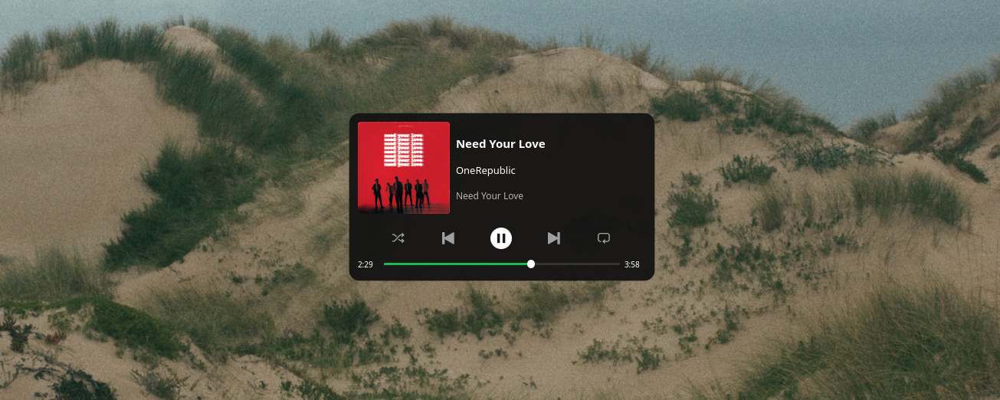

# Spotify Overlay

A minimal, always-on-top Spotify overlay for Linux.



## Features

- Album art, track title, artist, and album name
- Playback controls (play/pause, next, previous, shuffle, repeat)
- Progress bar with seek support
- Always-on-top overlay (KDE Plasma only)
- Communicates with Spotify via D-Bus (MPRIS)

## Install

```bash
pip install spotify-overlay
```

Or from source:

```bash
git clone https://github.com/maker-lukas/spotify-overlay.git
cd spotify-overlay
pip install .
```

## Usage

Make sure Spotify is running, then launch **Spotify Overlay** from your application menu like any other app.

You can also run it from the terminal:

```bash
spotify-overlay
```

## Requirements

- Linux with D-Bus
- Spotify desktop client
- Python 3.10+
- KDE Plasma (for always-on-top support)

## License

AGPL-3.0
